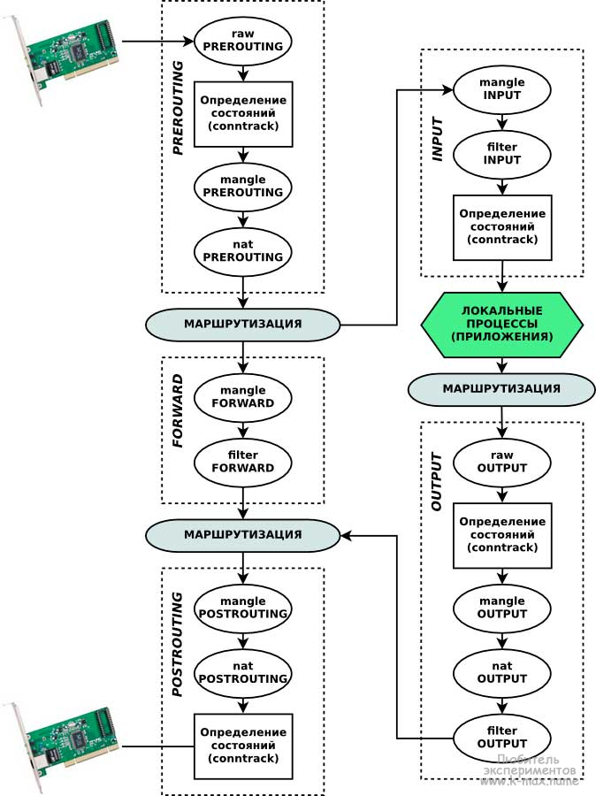

#  Фильтрация пакетов. Iptables, Firewalld
## Домашнее задание по теме "Фильтрация пакетов. Iptables, Firewalld"
Задание:
- реализовать knocking port
  centralRouter может попасть на ssh inetrRouter через knock скрипт пример в материалах
- добавить inetRouter2, который виден(маршрутизируется (host-only тип сети для виртуалки)) с хоста или форвардится порт через локалхост
- запустить nginx на centralServer
- пробросить 8080 порт на centralServer, на inetRouter2 80
- дефолт в инет оставить через inetRouter
- реализовать проход на 8080 порт без маскарадинга

Решение:

Есть 4 VM
1. inetRouter:
  - eth0 - шлюз для выхода в Интренет приватной сети 192.168.255.0/29, поднят как NAT на вагранте. Так же для подключения по ssh с хостовой машины  
  - eth1 - 192.168.255.2/29 приватная сеть
2. centralRouter:
  - eth0 - интерфейс вагранта для управления с хостовой машины.
  - eth1 - 192.168.255.3/29 приватная сеть
  - eth2 - 192.168.0.1/28 приватная сеть 2 (192.168.0.0/28), для подключения centralServer. Запуск на centralServer-е nginx-a и доступ к нему из других сетей/хостов
3. centralServer:
  - eth0 - интерфейс вагранта для управления с хостовой машины.
  - eth1 - 192.168.0.2/28 приватная сеть 2.
4. inetRouter2:
  - eth0 - интерфейс вагранта для управления с хостовой машины.
  - eth1 - 192.168.255.4/29 приватная сеть
  - eth2 - 192.168.255.10/29 приватная сеть 3 (192.168.255.8/29) организована на virtualbox-e по типу host-only, т.е сеть доступна с хостовой машины, на которой поднимается интрфейс из этой сети с адресом 192.168.255.9/29

Организовывать работу файрвола, для проброса потов и выхода в интернет машин из приватных сетей, будем с помощью iptables.
Для проброса 8080 порта с centralServer на inetRouter2 80, применим правило для iptables:

      iptables -A PREROUTING -t nat -m tcp -p tcp --dport 80 -j DNAT --to-destination 192.168.0.2:8080

Для организации доступа к проброшенному порту centralServer:8080 -> inetRouter2:80, можно использовать правило MASQARADE на  inetRouter2:

      iptables -t nat -A POSTROUTING --source 192.168.255.8/29 -o eth1 -j MASQUERADE    <----- MASQUERADE работает только для входящих адресов из (приватная сеть 3 - 192.168.255.8/29), т.е локально с хост системы

или прописать дополнительный route на centralRouter:

      ip r a 192.168.255.8/29 via 192.168.255.4

       разрешающий прхождение пакетов из приватной сети 192.168.255.8/29

[Правила Iptables на inetRouter2](./ansible/roles/gw/files/inetRouter2_iptables)

**Реализация порт knocking**

      [Скрипт для порт knocking ](./ansible/roles/gw_iptables/files/knock_ssh.sh)

Создадим правила для iptables, на inetrRouter, что реализовать порт-knocking:

      [Правила Iptables на inetRouter2](./ansible/roles/gw/files/inetRouter_iptables)
      В правилах оставлена возможность войти с хост-системы (10.0.2.2) на машину.

Для проверки работоспособности, предварительно попробовать зайти с centralRoter  ssh -o StrictHostKeyChecking=no vagrant@192.168.255.2, при неудаче, необходимо запустить скрипт, с параметрами:

      ./knock_ssh.sh 192.168.255.2 8088 7077 9099

и с виртуальной машины centralRoter пробуем зайти ssh -o StrictHostKeyChecking=no vagrant@192.168.255.2 

#   Общая теория, примеры, полезности.

- **Netfilter — межсетевой экран управляется утилитой iptables (Для IPv6 — ip6tables).**  

[Структура прохождения пакета по netfilter](Images/IPTables_process_flow.png)

[Интересная статья о защите от DDoS](https://javapipe.com/blog/iptables-ddos-protection/)

###   Управление правилами сетевой фильтрации Netfilter (использование команды iptables)

Утилита iptables является интерфейсом для управления сетевым экраном netfilter. Данная команда позволяет редактировать правила таблиц, таблицы и цепочки. Как я уже говорил - каждое правило представляет собой запись/строку, содержащую в себе критерии отбора сетевых пакетов и действие над пакетами, которые соответствуют заданному правилу. Команда iptables требует для своей работы прав root.

В общем случае формат команды следующий:

- **iptables [-t таблица] команда [критерии] [действие]**

Таблица 1.    Команды и параметры утилиты iptables

<table>

  <tr>
    <th>Параметр</th>
    <th>Описание</th>
    <th>Пример</th>
  </tr>
  <tr>
      <th></th>
      <th>КОМАНДЫ</th>
      <th></th>
  </tr>
  <tr>
      <td>--append (-A)</td>
      <td>Добавить в указанную цепочку и указанную таблицу заданное правило в КОНЕЦ списка.</td>
      <td>ptables -A FORWARD критерии -j действие</td>
  </tr>
  <tr>
      <td>--delete (-D)</td>
      <td>Удаляет заданное номером(ами) или правилом(ами) правило(а). Первый пример удаляет все правила с номерами 10,12 во всех цепочках, в таблицах filter, второй пример удаляет заданное правило из таблицы mangle в цепочке PREROUTING.</td>
      <td>iptables -D 10,12
iptables -t mangle -D PREROUTING критерии -j действие</td>
  </tr>
  <tr>
      <td>--rename-chain (-E)</td>
      <td>Изменить имя цепочки.</td>
      <td>iptables -E OLD_CHAIN NEW_CHAIN</td>
  </tr>
  <tr>
      <td>--flush (-F)</td>
      <td>Очистка всех правил текущей таблицы. Ко всем пакетам, которые относятся к уже установленным соединениям, применяем терминальное действие ACCEPT — пропустить</td>
      <td>iptables -F</td>
  </tr>
  <tr>
      <td>--insert (-I)</td>
      <td>Вставляет заданное правило в место, заданное номером.</td>
      <td>iptables -I FORWARD 5 критерии -j действие</td>
  </tr>
  <tr>
      <td>--list (-L)</td>
      <td>Просмотр существующих правил (без явного указания таблицы - отображается таблица filter всех цепочек).</td>
      <td>iptables -L</td>
  </tr>
  <tr>
      <td>--policy (-P)</td>
      <td>Устанавливает стандартную(по умолчанию) политику для заданной цепочки.</td>
      <td>iptables -t mangle -P PREROUTING DROP</td>
  </tr>

<tr>
      <td>--replace (-R)</td>
      <td>Заменяет заданное номером правило на заданное в критериях.</td>
      <td>iptables -R POSROUTING 7 | критерии -j действие</td>
  </tr>
  <tr>
      <td>--delete-chain (-X)</td>
      <td>Удалить ВСЕ созданные вручную цепочки (оставить только стандартные INPUT, OUTPUT, FORWARD, PREROUTING и POSTROUTING).</td>
      <td>iptables -X</td>
  </tr>
  <tr>
      <td>--zero (-Z)</td>
      <td>Обнуляет счетчики переданных данных в цепочке.</td>
      <td>iptables -Z INPUT</td>
  </tr>
  <tr>
      <th></th>
      <th>ПАРАМЕТРЫ</th>
      <th></th>
  </tr>
  <tr>
      <td>--numeric (-n)</td>
      <td>Не резолвит адреса и протоколы при выводе.</td>
      <td></td>
  </tr>
  <tr>
      <td>--line-numbers</td>
      <td>Указывать номера правил при выводе (может использоваться совместно с -L).</td>
      <td>iptables -L --line-numbers</td>
  </tr>
  <tr>
      <td>-t таблица</td>
      <td>Задает название таблицы, над которой необходимо совершить действие. В примере сбрасываются все цепочки в  таблице nat.</td>
      <td>iptables -t nat -F</td>
  </tr>
  </table>

###   Критерии (параметры) отбора сетевых пакетов команды iptables

Критерии отбора сетевых пакетов негласно делятся на несколько групп:

- Общие критерии
- Неявные критерии
- Явные критерии

 **Общие критерии** допустимо употреблять в любых правилах, они не зависят от типа протокола и не требуют подгрузки модулей расширения. **Неявные критерии**,  т.е. критерии, которые подгружаются неявно и   становятся доступны, например при указании общего критерия --protocol tcp|udp|icmp. Перед использованием **Явных критериев**, необходимо подключить дополнительное расширение (это своеобразные  плагины для netfilter). **Дополнительные расширения подгружаются с помощью параметра -m или --match**. Так, например, если мы собираемся использовать критерии conntrack, то мы должны явно указать это в   строке правила: -m conntrack левее используемого критерия. Отличие между явными и неявными необщими критериями заключается в том, что явные нужно подгружать явно, а неявные подгружаются автоматически. Во всех критериях можно использовать знак ! перед значением критерия. Это будет означать, что под данное правило подпадают все пакеты, которые не соответствуют данному параметру.

      **! --protocol tcp** - такая запусь будет обозначать, что все пакеты, которые не являются TCP-протоколом подходят под действие правила

<table>

  <tr>
    <th>Параметр</th>
    <th>Описание</th>
    <th>Пример</th>
  </tr>
  <tr>
      <td></td>
      <td>Общие параметры</td>
      <td></td>
  <tr>
  <tr>
      <td>--protocol (-p)</td>
      <td>Определяет протокол транспортного уровня. Опции tcp, udp, icmp, all или любой другой протокол определенный в /etc/protocols</td>
      <td>iptables -A INPUT -p tcp</td>
  <tr>
  <tr>
      <td>--source(-s, --src)</td>
      <td>P адрес источника пакета. Может быть определен несколькими путями:
Одиночный хост: host.domain.tld, или IP адрес: 10.10.10.3
Пул-адресов (подсеть): 10.10.10.3/24 или 10.10.10.3/255.255.255.0
Настойчиво не рекомендуется использовать доменные имена, для разрешения (резольва) которых требуются DNS-запросы, так как на этапе конфигурирования netfilter DNS может работать некорректно. Также, заметим, имена резольвятся всего один раз — при добавлении правила в цепочку. Впоследствии соответствующий этому имени IP-адрес может измениться, но на уже записанные правила это никак не повлияет (в них останется старый адрес). Если указать доменное имя, которое резольвится в несколько IP-адресов, то для каждого адреса будет добавлено отдельное правило.</td>
      <td>iptables -A INPUT -s 10.10.10.3</td>
  <tr>
  <tr>
      <td>--destination(-d)</td>
      <td>IP адрес назначения пакета. Может быть определен несколькими путями (см. --source).</td>
      <td>iptables -A INPUT --destination 192.168.1.0/24</td>
  <tr>
  <tr>
      <td>--in-interface(-i)</td>
      <td>Определяет интерфейс, на который прибыл пакет. Полезно для NAT и машин с несколькими сетевыми интерфейсами. Применяется в цепочках INPUT, FORWARD и PREROUTING. Возможно использование знака "+", тогда подразумевается использование всех интерфейсов, начинающихся на имя+ (например eth+ - все интерфейсы eth).</td>
      <td>iptables -t nat -A PREROUTING --in-interface eth0</td>
  <tr>
  <tr>
      <td>--out-interface(-o)</td>
      <td>Определяет интерфейс, с которого уйдет пакет. Полезно для NAT и машин с несколькими сетевыми интерфейсами. Применяется в цепочках OUTPUT, FORWARD и POSTROUTING. Возможно использование знака "+".</td>
      <td>iptables -t nat -A POSTROUTING --in-interface eth1</td>
  <tr>
  <tr>
      <td></td>
      <td>Неявные (необщие) параметры</td>
      <td></td>
  <tr><tr>
      <td>-p proto -h</td>
      <td>вывод справки по неявным параметрам протокола proto.</td>
      <td>iptables -p icmp -h</td>
  <tr>
  <tr>
      <td>--source-port(--sport)</td>
      <td>Порт источник, возможно только для протоколов --protocol tcp, или --protocol udp</td>
      <td>iptables -A INPUT --protocol tcp --source-port 25</td>
  <tr>
  <tr>
      <td>--destination-port(--dport)</td>
      <td>Порт назначения, возможно только для протоколов --protocol tcp, или --protemocol udp</td>
      <td>iptables -A INPUT --protocol udp --destination-port 67</td>
  <tr>
  <tr>
      <td></td>
      <td>Явные параметры</td>
      <td></td>
  <tr>
  <tr>
      <td>-m conntrack --ctstate</td>
      <td>Состояние соединения. Доступные опции:  
NEW (Все пакеты устанавливающие новое соединение)
ESTABLISHED (Все пакеты, принадлежащие установленному соединению)
RELATED (Пакеты, не принадлежащие установленному соединению, но связанные с ним. Например - FTP в активном режиме использует разные соединения для передачи данных. Эти соединения связаны.)
INVALID (Пакеты, которые не могут быть по тем или иным причинам идентифицированы. Например, ICMP ошибки не принадлежащие существующим соединениям)
и др.</td>
      <td>iptables -A INPUT -m conntrack --ctstate NEW,ESTABLISHED</td>
  <tr>
  <tr>
      <td>-m mac --mac-source</td>
      <td>Задает MAC адрес сетевого узла, передавшего пакет. MAC адрес должен указываться в форме XX:XX:XX:XX:XX:XX.</td>
      <td>-m mac --mac-source 24:12:B0:A4:F6:03 Действия над пакетами</td>
  <tr>

</table>

####  Действия над пакетами, которые совпали с критериями отбора

Для совершения какого-либо действия над пакетами, необходимо задать ключ **_-j (--jump)_** и указать, какое конкретно действие совершить.

- ACCEPT - пакет покидает данную цепочку и передается в следующую (дословно - ПРИНЯТЬ).
- DROP - отбросить удовлетворяющий условию пакет, при этом пакет не передается в другие таблицы/цепочки.
- REJECT - отбросить пакет, отправив отправителю ICMP-сообщение, при этом пакет не передается в другие таблицы/цепочки.
- RETURN - возвратить пакет в предыдущую цепочку и продолжить ее прохождение начиная со следующего правила.
- SNAT - применить трансляцию адреса источника в пакете. Может использоваться только в цепочках POSTROUTING и OUTPUT в таблицах nat.
- DNAT - применить трансляцию адреса назначения в пакете. Может использоваться в цепочке PREROUTING в таблице nat. (в исключительных случаях - в цепочке OUTPUT)
- LOG - протоколировать пакет (отправляется демону syslog) и обработать остальными правилами.
- MASQUERADE — используется вместо SNAT при наличии соединения с динамическим IP (допускается указывать только в цепочке POSTROUTING таблицы nat).
- MARK — используется для установки меток на пакеты, передается для обработки дальнейшим правилам.
- REDIRECT - Действие REDIRECT предназначено для перенаправления пакетов с одного набора портов на другой внутри одной системы, **не выходя за пределы хоста**.

- **--tcp-flags:**

      URG - срочное сообщение;
      ACK - квитанция на принятый сегмент;
      PSH - запрос на отправку сообщения без ожидания заполнения буфера;
      RST - запрос на восстановление соединения;
      SYN - сообщение используемое для синхронизации счетчиков переданных данных при установлении соединения;
      FIN - признак достижения передающей стороной последнего байта в потоке передаваемых данных.

      Флаги: _**SYN ACK FIN RST URG PSH ALL NONE**_
      Совпадение, когда флаги TCP указаны правильно. Первый аргумент mask-это флаги, которые мы должны изучить, записанные в виде списка, разделенного запятыми, а второй аргумент - это разделенный запятыми список флагов, которые должны быть установлены. Отсюда и команда: _**iptables -A FORWARD -p tcp --tcp-flags SYN,ACK,FIN,RST SYN**_ будет соответствовать только пакетам с установленным флагом SYN , а флаги ACK, FIN and RST не установлены. Это соответствует новому соединению "--syn"

##### Критерии
1. Явные критерии - Перед использованием этих расширений, они должны быть загружены явно, с помощью ключа -m или –match.
2. Неявные критерии -  должен быть указан протокол (ключ -p).
3. Общие критерии - не зависят от типа протокола и не требуют загрузки специального модуля.

- **_CONNTRACK_**

Модуль(критерий) conntrack позволяет реализовать межсетевой экран сеансового уровня (пятого уровня модели OSI). Для управления данным механизмом используется утилита **conntrack**, а так же параметр утилиты **iptables: -m conntrack или -m state (устарел)** Состояния текущих соединений conntrack хранит в ядре. Их можно просмотреть в файле **_/proc/net/nf_conntrack_** (или **_/proc/net/ip_conntrack_**) Conntrack анализирует состояние всех пакетов, кроме тех, которые помечены как NOTRACK в таблице raw. На основе этого состояния определяется принадлежит пакет новому соединению (состояние NEW), уже установленному соединению (состояние ESTABLISHED), дополнительному к уже существующему (RELATED), либо к "другому" (неопределяемому) соединению (состояние INVALID).

##### Действия (Target)

- _**REDIRECT:**_

      **Действие REDIRECT предназначено для перенаправления пакетов с одного набора портов на другой внутри одной системы, не выходя за пределы хоста.**

      Работает REDIRECT только в цепочках PREROUTING и OUTPUT таблицы nat. Таким образом, область применения сводится только к перенаправлению с одного порта на другой. Чаще всего это используется для прозрачного прокси, когда клиент из локальной сети коннектится на 80 порт, а шлюз редиректит пакеты на локальный порт прокси:

      iptables -t nat -A PREROUTING -p tcp --dport 80 -j REDIRECT --to-port 3128

_REDIRECT и удаленный клиент:_

      правило будет работать только для внешних клиентов и только при открытом порте приложения.

      iptables -t nat -A PREROUTING -p tcp --dport 5555 -j REDIRECT --to-port 22

_REDIRECT и локальный клиент:_

      предыдущее правило для самого хоста с iptables не сработает, т.к. пакеты с localhost не попадают в таблицу nat. Чтобы кейс сработал на локальной машине — надо добавить редирект в цепочку OUTPUT таблицы nat:

      iptables -t nat -A OUTPUT -p tcp -s 127.0.0.1 --dport 5555 -j REDIRECT --to-ports 22

Анти DDos

Пакеты в статусе INVALID:

      iptables -t mangle -A PREROUTING -m conntrack --ctstate INVALID -j DROP

Стандартно новые пакеты, которые таковыми ек являются:

      iptables -t mangle -A PREROUTING -p tcp ! --syn -m conntrack --ctstate NEW -j DROP

Блокировать необычные значения MSS:

      iptables -t mangle -A PREROUTING -p tcp -m conntrack --ctstate NEW -m tcpmss ! --mss 536:65535 -j DROP
